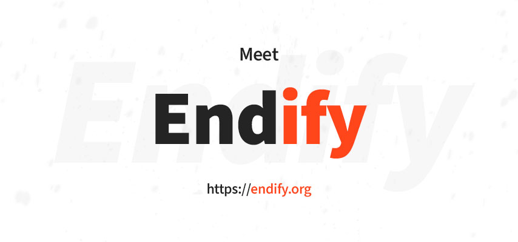

<p align="center">
 
 
 
 
</p>

<h1 align="center">Endify</h1>
<p align="center">
Endify is a JavaScript framework aimed at connecting frontend and backend code into one codebase, which opens new possibilities to the world of code.</p>

-------
 ## Motivation
 I was working with Vue Storefront and Nuxt for a while, but their biggest mistake was that it's not everything to make the website work. Of course you need an API in another project, some workers, services and so on... So I realized that why not to connect them both? And here it is - Endify.
 
## Status
Package | Status | Description
--- | --- | ---
@endify/cli | 1.0.0-alpha.1 👽 | Command line tool that runs @endify/server along with @endify/electron
@endify/server | in progress | Runs backend code & serves client bundles
@endify/vue | in progress | Default client setup (and the only one for now)
@endify/electron | <span style="color:#ff461a">n/a</span> | Adds native app support
@endify/extensions | <span style="color:#ff461a">n/a</span> | Allows Endify to be extended with extensions
@endify/static | <span style="color:#ff461a">n/a</span> | Adds /static folder support
@endify/vue-script-loader | <span style="color:#ff461a">n/a</span> | Load `.endify.vue` files
create-endify-app | <span style="color:#ff461a">n/a</span> | Init simple endify app
@endify/hello-template | <span style="color:#ff461a">n/a</span> | Template which is being used by create-endify-app


 ## Features
 It supports a lot of things (out of the box!):

 ✔️ Frontend with **Vue.js**

 ✔️ Backend in **Node.js**
 
 ✔️ One codebase
 
 ✔️ Extending frontend & backend with **plugins**
 
 ✔️ **Vuex** store
 
 ✔️ Code splitting

 ✔️ Great treeshaking (isn't it the same as above?)

 ✔️ **Electron** - Yeah, you write once, you get a website and an app for Windows & Mac, so cool!
 
 ✔️ **SSR** (Server side rendering)
 
 ✔️ **Hot reload of frontend and backend** (woah! I worked a few weeks on that)
 
 ✔️ It's fully **dockerized**

 ✔️ You manually choose between npm, yarn or pnpm
 
 ✔️ It has some **Github Actions** examples of Testing & Building
 
 ✔️ And even it has some great tutorial on how to apply image to **kubernetes** with Github Actions!
`

|                               | Endify       | Nuxt.js                  |   |
|--------------------------------|--------------|--------------------------|---|
| Frontend hot reload            | ✅ Yes        | ✅ Yes                    |   |
| Backend hot reload             | ✅ Yes        | ❌ No                     |   |
| Proper 404/500 errors handling | ✅ Yes        | ❌ No                     |   |
| asdasd                         | ✅ Yes        | ❌ No                     |   |
| Initial bundle time            | ⚡ 0.24s      | 4.02s                    |   |
| Average hot reload time        | ⚡ 0.04s      | 1.02s                    |   |
| Plugins                        | Full support | Only client side support |   |
| Release date                   | 23 jun 2020  | 19 dec 2018              |   |


## Getting started

### Install Endify
Installing Endify is easy and should take less than a minute. All you have to do is type one of the following commands into your console:
```bash
# Recommended for beginners
$ npx hello-endify 

# Install with yarn create
$ yarn create endify

# Install with npm
$ npm create endify
```
