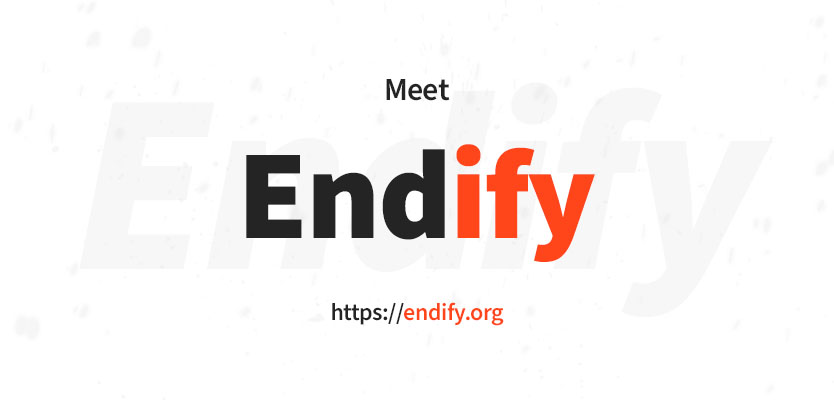

<p align="center">
 
 
 
 
</p>

<h1 align="center">Endify</h1>
<p align="center">JS Framework connecting backend, frontend and native JavaScript based apps</p>

-------
 ## Motivation
 I was working with Vue Storefront and Nuxt for a while, but their biggest mistake was that it's not everything to make the website work. Of course you need an API in another project, some workers, services and so on... So I realized that why not to connect them both? And here it is - Endify.
 
 ## Features
 It supports a lot of things (out of the box!):

 ✔️ Frontend with **Vue.js**

 ✔️ Backend in **Node.js**
 
 ✔️ One codebase
 
 ✔️ Extending frontend & backend with **plugins**
 
 ✔️ **Vuex** store
 
 ✔️ Code splitting

 ✔️ Great treeshaking (isn't it the same as above?)

 ✔️ **Electron** - Yeah, you write once, you get a website and an app for Windows & Mac, so cool!
 
 ✔️ **SSR** (Server side rendering)
 
 ✔️ **Hot reload of frontend and backend** (woah! I worked a few weeks on that)
 
 ✔️ It's fully **dockerized**

 ✔️ You manually choose between npm, yarn or pnpm
 
 ✔️ It has some **Github Actions** examples of Testing & Building
 
 ✔️ And even it has some great tutorial on how to apply image to **kubernetes** with Github Actions!
`


## Getting started

### Install Endify
Installing Endify is easy and should take less than a minute. All you have to do is type one of the following commands into your console:
```bash
# Recommended for beginners
$ npx hello-endify 

# Install with yarn create
$ yarn create endify

# Install with npm
$ npm create endify
```
